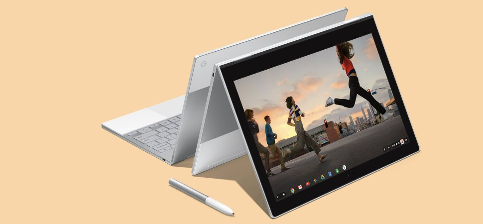

# day4
<html>
<head>
<meta name="viewport" content="width=device-width, initial-scale=1">
<link rel="stylesheet" href="https://cdnjs.cloudflare.com/ajax/libs/font-awesome/4.7.0/css/font-awesome.min.css">
<link rel="stylesheet" href="css/style.css">
<link rel="shortcut icon" href="css/sss.png" type="image/x-icon">
<title>Technosaraus</title>
<link rel="stylesheet" href="https://cdnjs.cloudflare.com/ajax/libs/font-awesome/4.7.0/css/font-awesome.min.css">

  
<h1>TECHNOSARAUS</h1>

    <a href="#home" class="active">Home</a>
    <a href="#gallery">Gallery</a>
    <a href="#contact">Contact Us</a>
    <a href="javascript:void(0);" class="icon" onclick="myFunction()">
      <i class="fa fa-bars"></i>
    </a>
  

</head>
<body class="flex-container">
  

  

   <h1>HOME</h1>
   
Lorem ipsum dolor sit amet consectetur adipisicing elit. Sunt quaerat est neque quibusdam placeat porro, consequatur dolorum, explicabo, quisquam exercitationem illum cum  delectus ducimus numquam animi suscipit. Magnam, delectus nisi?
  Lorem, ipsum dolor sit amet consectetur adipisicing elit. Placeat laboriosam provident qui mollitia, ratione eaque laborum  pariatur eligendi accusantium debitis facere, natus temporibus molestiae quis perspiciatis at voluptatem ipsum earum?
Lorem ipsum dolor sit amet consectetur, adipisicing elit. Doloribus repudiandae vel ad sit consequuntur,  porro debitis fugiat nobis perferendis nostrum harum maxime in ea non facere veniam architecto, deleniti maiores?  

  

  <h1>
GALLERY
</h1>
  <figure class="visible">
    
   <figcaption>Macbook Air</figcaption>
  </figure>
  <figure>
    
    <figcaption> Macbook Pro</figcaption>
  </figure>
  <figure>
    
    <figcaption>Alienware Area 51 M15x</figcaption>
  </figure>
  <figure>
    
    <figcaption>Samsung S20</figcaption>
  </figure>
  <figure>
    
    <figcaption>Google Pixelbook</figcaption>
  </figure>
  

<h1>
CONTACT US
</h1>

    
Lorem ipsum dolor sit amet consectetur adipisicing elit. Iste numquam laborum sed delectus iusto aliquid  rem quis magnam, eius cum ea minima doloremque ipsam voluptate repellendus dolore? Recusandae, quasi obcaecati.

<button type="button" class="collapsible">Read More</button>

    

    
Lorem ipsum dolor sit amet consectetur, adipisicing elit. Tempora autem molestiae corporis quidem mollitia nesciunt ipsum fugiat, neque nobis iste iure. Numquam exercitationem voluptatum eveniet sequi porro  ex commodi similique?Lorem ipsum dolor sit amet consectetur adipisicing elit. Nesciunt distinctio qui mollitia iusto nulla, quas a  eligendi at asperiores labore ipsum eos, facere molestias! Beatae praesentium iure molestiae non quisquam.

    

  

<footer id="sls" class="flex-item">

</footer>

</body>
</html>
